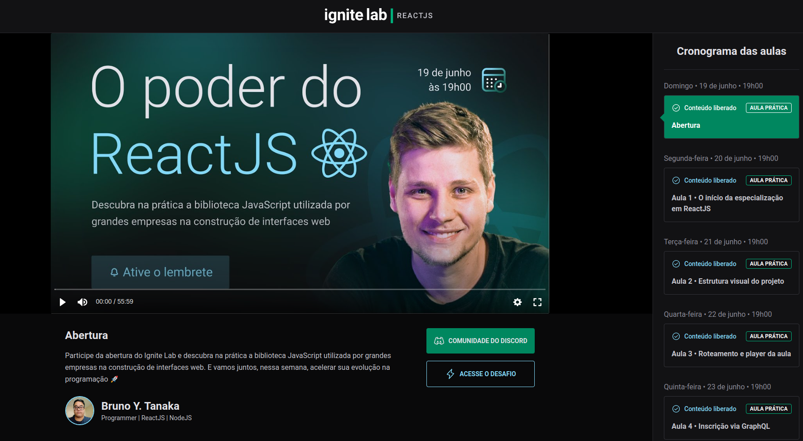

# Event Platform

# Project Preview


# Table of Content

- [Table of Content](#table-of-content)
  - [1. About The Project](#1-about-the-project)
  - [2. Libraries & Frameworks](#2-libraries--frameworks)
  - [3. Installation & Set Up](#3-installation--set-up)
  - [4. License](#4-license)

# 1. About the project
  This project was developed using [Vite](https://vitejs.dev/) using [GraphCMS](https://app.graphcms.com/).

  It is a web for watch classes.

# 2. Libraries & Frameworks

| Name                                                     | Description                                                            |
| -------------------------------------------------------- | ---------------------------------------------------------------------- |
| [ViteJS](https://vitejs.dev/)           | Next Generation Frontend Tooling.               |
| [Tailwind CSS](https://tailwindcss.com/)                             | A utility-first CSS framework packed with classes like flex, pt-4, text-center and rotate-90 that can be composed to build any design, directly in your markup.
| [Apollo Client React](https://www.apollographql.com/docs/react/)|   Apollo Client is a comprehensive state management library for JavaScript that enables you to manage both local and remote data with GraphQL.                      |
| [Phosphor Icons](https://phosphoricons.com/)| Phosphor is a flexible icon family for interfaces, diagrams, presentations — whatever, really.                            |
| [GraphQL](https://graphql.org/)    | GraphQL is a query language for APIs and a runtime for fulfilling those queries with your existing data. |
| [GraphQL Code Generator](https://www.graphql-code-generator.com/) |Generate anything from GraphQL schema / operations!. |


# 3. Installation & Set Up

1. Clone this repository

```bash
  git clone https://github.com/BrunoYTanaka/vitejs-event-platform.git
```
2. Enter the repository folder

```bash
   cd vitejs-event-platform
```

3. Install the dependencies

```bash
   yarn install or npm install
```

4. Start application on port 3000

```bash
  yarn dev or npm run dev
```

5. Access localhost
```
  localhost:3000
```

# 4. License

This project is licensed under the MIT License - see the [LICENSE.md](LICENSE.md) file for more information.